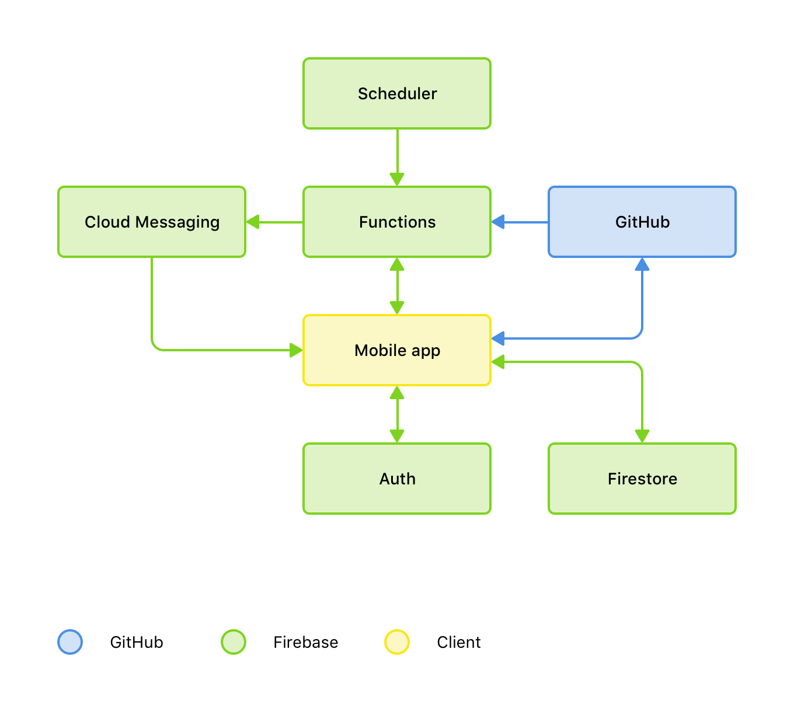

I started working on Mittens last year. I kept missing notifications from GitHub. Due to the volume of emails, I had filtered GitHub notifications from my inbox. However, I was always late to the party. I was missing out on pull requests and issues unless someone also let me know on Slack.

When I started building Mittens, there was no right way to fetch notifications; there still isn't. However, at least we have something cheaper and scalable.

The first version of Mittens was a React Native app, backed by a Node API hosted on Heroku. It wasn't the best system, but it worked. I wrote the API to keep it as light as possible so that it could fetch user notifications every minute, which would be an improvement over other paid apps on the App Store that usually check every 10 minutes for notifications.

I got busy with other stuff, as it always happens, and forgot about Mittens for a while. Until last month, when I was doing an app release for February. I know this post is late, but the app wasn't.

The new version of Mittens is much better, although I still think there's room for improvement. It's still React Native, but I only published on the App Store for the moment. The backend is still Node, but now uses Firebase extensively; Firebase for authentication, Firestore for storing data, Cloud Functions for auth and fetching notifications, and Cloud Messaging for push notifications.

The code, as usual, is publicly available on [GitHub](https://github.com/mittens-the-cat).

Take it for a spin, and let me know what you think: [Mittens on the App Store](https://itunes.apple.com/us/app/mittens/id1453383568?mt=8).
